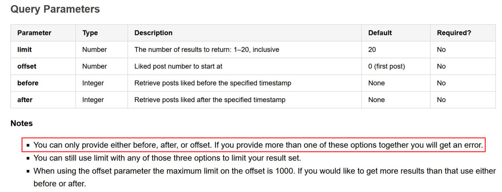

## Exercise description

The objective of this exercise is to implement validation code that verifies if the dependencies among input parameters of an API operation are fulfilled. If the dependencies are not met, an error will be returned. You will work on a template project generated from the OpenAPI Specification (OAS) of the Tumblr API ("Blog Likes" operation). The screenshot below shows a fragment of the API documentation highlighting the dependencies between parameters.

## IDL:
     ZeroOrOne(before OR after, offset);

## Instructions:

- **Step 0:** Clone/download the project and open it in IntelliJ.
- **Step 1:** Open the Java interface “**BlogApi**“ located in the package “org.openapitools.api”. Check the code and make sure that you understand it. Ask for clarifications if needed.
- **Step 2:** Make sure you understand the inter-parameter dependencies that you must implement, highlighted in the screenshot shown above. Ask the teacher if you have any questions.
- **Step 3:** Before you start coding, add the start time in the “**Start time**” comment section.
- **Step 4:** Add the validation code for the highlighted dependencies under the “**Add validation code here**” comment section. Each validation block should return a 400 HTTP status code with a simple error message. **Example:** If a document requires that p1 must be greater than p2, then a possible validation code could be as follows:

      if (! (p1 > p2) )
         return new ResponseEntity("p1 must be greater than p2", HttpStatus.BAD_REQUEST);

- **Step 5:** Test your code using a client like Postman or the interactive documentation generated by Swagger (available at http://localhost:8082/swagger-ui/index.html). Remember the application is listening in port 8082.
- **Step 6:** Once you implement and test the validation code for all the dependencies, indicate the end time at the "**End time**" comment section.
- **Step 7:** Save the project as a zip file and submit it through the virtual platform following the instructions provided by the teacher.
