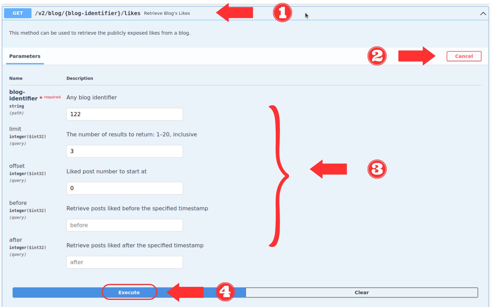
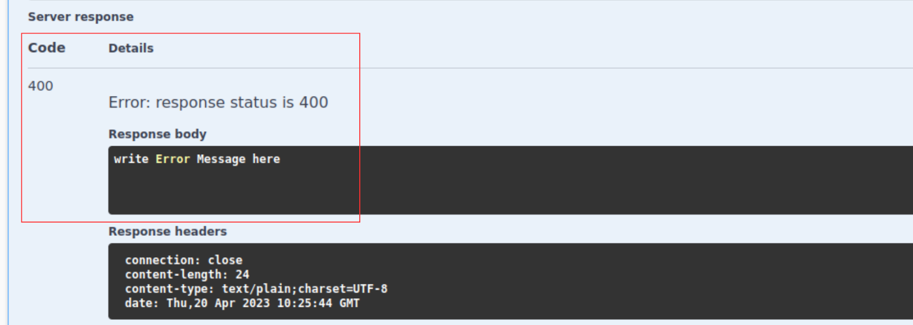

# OpenAPI generated server

Spring Boot Server

## Overview
This server was generated by the [OpenAPI Generator](https://openapi-generator.tech) project.
By using the [OpenAPI-Spec](https://openapis.org), you can easily generate a server stub.
This is an example of building a OpenAPI-enabled server in Java using the SpringBoot framework.

The underlying library integrating OpenAPI to Spring Boot is [springdoc](https://springdoc.org).
Springdoc will generate an OpenAPI v3 specification based on the generated Controller and Model classes.
The specification is available to download using the following url:
http://localhost:8082/v3/api-docs/

Start your server as a simple java application

You can view the api documentation in swagger-ui by pointing to
http://localhost:8082/swagger-ui.html

Change default port value in application.properties

## Inter-parameter dependencies in web APIs
Web APIs usually include dependencies and constraints between the API parameters. These constraints restrict the way in which two or more input parameters can be combined to form a valid call to the service we called “Inter-parameter dependencies”. They make interacting with the services difficult because API specification languages offer little or no support for them. Martin-Lopez et al reviewed 40 industrial APIs and found that 85% of them contain inter-parameter dependencies [1]. More importantly, they classified all the dependencies found (over 600) into seven main dependency types.

## Task Description

The aim of this project is to implement a validation code of several parameter dependencies and constraints of the Tumblr API documentation to measure the time required for implementing the validation code. To ensure that the participant will not miss any dependencies in this example, we highlighted them as shown in the screenshot below:

## To complete the task, follow these steps:

- **Step 1 (Open the project):** Open the interface “BlogApi“ located in the package “org.openapitools.api”. Your task is to add the validation code for the “getBlogLikes” method.
- **Step 2 (Read the documentation):** Read and understand the highlighted part in the screenshot carefully that describes the dependencies and constraints between input parameters.
- **Step 3 (Add Start time):** Before you start coding, add the start time in the “**Start time**” comment section.
- **Step 4 (Add validation code):** Add the validation code for the highlighted dependencies and constraints in the “**Add validation code here**” comment section. Each validation block you add should return a status code 400 with a simple error message that describes the issue. **Example:** If a document requires that p1 must be greater than p2, then a possible validation code could be as follows:

      if (! (p1 > p2) )
         return new ResponseEntity("p1 must be greater than p2", HttpStatus.BAD_REQUEST);
 
- **Step 5 (Test the project):** To test the code you can use the Swagger UI as follows:

  - First, run the Spring project, the project will run on port 8082
  - Open a browser and access the Swagger UI  from the link "http://localhost:8082/swagger-ui/index.html".
  - Then Click the Get method then click “Try it out” to add parameter values.
  - After adding the parameter values, click execute to execute the request.
  
   &nbsp;
    
   &nbsp;

  - If the validation code is correct, the response will be 200 OK. Otherwise, the response will be 400 Bad Request with a simple error message that describes the issue.
   
   &nbsp;
    
   &nbsp;

- **Step 6 (Add end time):** If you completed the task (implement the validation code that covers all dependencies), add the end time at the "**End time**" comment section.
- **Step 7 (Submit the project):** The last step is to submit your project . . .

